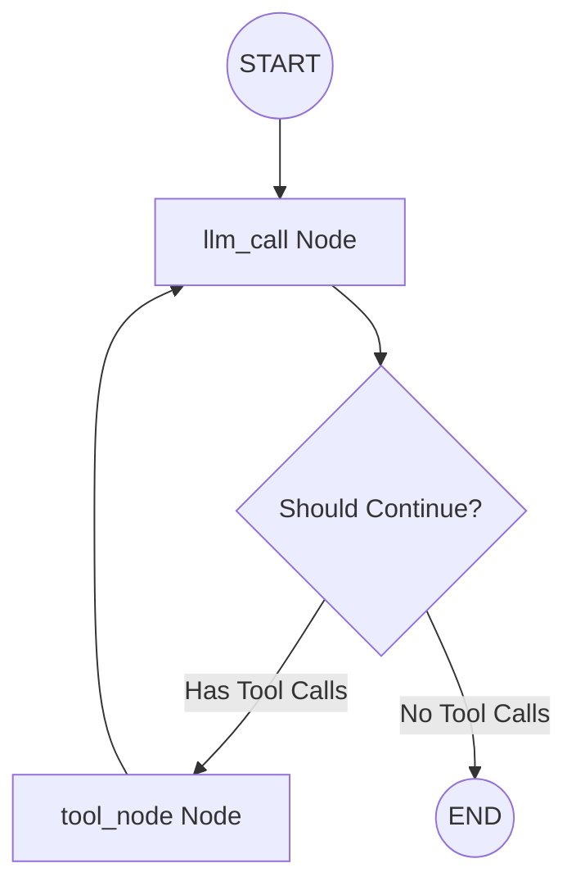

# LangGraph RAG Demo

A conversational assistant built with **LangGraph**, **Groq**, and **Streamlit** that combines mathematical tools with a Retrieval-Augmented Generation (RAG) system querying a local vector store.

The project features a beautiful chat interface and a live **Tool Trace** sidebar showcasing how the agent routes queries to different tools or responds directly.

---

## Architecture & Graph Flow

The agent utilizes a StateGraph that orchestrates communication between the LLM and the tools:



- **State (`MessagesState`)**: Maintains a list of message history and logs the number of LLM invocations.
- **`llm_call` Node**: Invokes Groq's LLM (`openai/gpt-oss-20b`) bound with helper tools. It decides whether to delegate tasks to tools or provide the final answer.
- **`tool_node` Node**: Executes tool calls requested by the LLM and returns outputs as `ToolMessage` instances back to the graph state.
- **Conditional Routing**: The router (`should_continue`) checks if the last AIMessage contains tool calls, directing the workflow to either the `tool_node` or ending the sequence.

---

## Features

- **Live Tool Trace**: A dedicated Streamlit sidebar showing detailed JSON payloads of inputs and outputs for every tool call executed during a turn.
- **Agentic Tools**:
  - **Arithmetic Tools**: `add`, `multiply`, and `divide` for executing math calculations.
  - **Knowledge Search Tool (`search_docs`)**: Performs vector similarity search over locally ingested documents (e.g. AI concepts) using Gemini embeddings and a FAISS database.
- **Document Ingest Pipeline**: A parser that splits text documents, embeds them, and saves the vector index locally.

---

## Setup & Installation

### 1. Prerequisites
- Python `>= 3.13`
- API keys for:
  - **Groq** (for agent reasoning)
  - **Google Gemini** (for generating embeddings)

### 2. Install Dependencies
Install the required packages using pip:
```bash
pip install -r requrements.txt
```
*(Alternatively, if you are using `uv`, you can run `uv sync` to set up your virtual environment via `pyproject.toml`)*

### 3. Environment Variables
Create a `.env` file in the root directory (refer to `.env.example`):
```env
GROQ_API_KEY="your-groq-api-key"
GOOGLE_API_KEY="your-google-api-key"
```

---

## Usage Instructions

### Step 1: Ingest Knowledge Documents
To build the vector database from documents inside the `sample_docs/` folder, run the ingestion script:
```bash
python ingest.py
```
This splits the content of `sample_docs/*.txt` into chunks, embeds them via `models/gemini-embedding-001`, and saves the vector store in the `faiss_index/` directory.

### Step 2: Launch the Streamlit App
Run the Streamlit application:
```bash
streamlit run app.py
```
Open the provided local URL (typically `http://localhost:8501`) in your browser to interact with the assistant.

---

## Project Structure

- `app.py`: Streamlit frontend with chat UI and tool tracing.
- `agent.py`: LangGraph architecture, StateGraph definition, tools (`add`, `multiply`, `divide`, `search_docs`), and model initialization.
- `ingest.py`: Script to process sample documents and build the FAISS index.
- `sample_docs/`: Directory containing target source documents (like `ai_concepts.txt`) for ingestion.
- `faiss_index/`: Local directory where FAISS vector index files are saved.
- `requrements.txt`: Core Python dependencies.
- `pyproject.toml`: Project metadata and dependency configuration.
- `.env.example`: Template for credentials.
